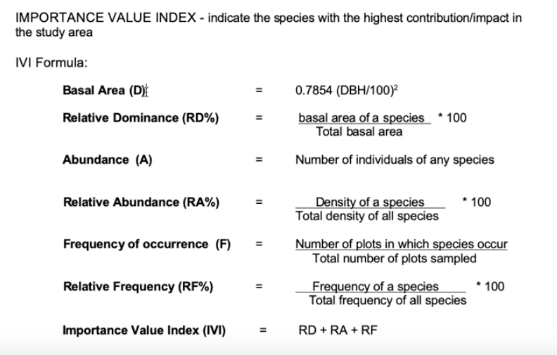
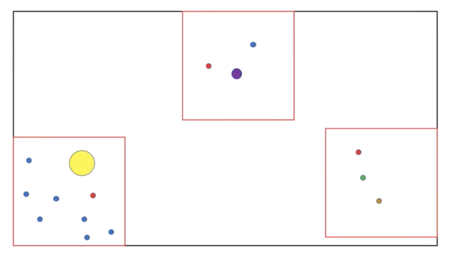

```{r setup, include=FALSE}
knitr::opts_chunk$set(echo = TRUE)
```

## IVI for ecologists

What is IVI?
The Importance Value Index (IVI) shows the complete or overall picture of ecological importance of the species in a community. Community structure study is made by studying frequency, density, abundance and basal cover of species.
link: https://www.biologydiscussion.com/experiments/experiments-on-ecology-biology/56545
Watch video here: https://youtu.be/KXRxF9PqqaA

```{r message=FALSE, echo=FALSE}

```


```{r echo=FALSE, message=FALSE}

```

* Black rectangle is your study landscape and the red boxes are plots. 
* Small blue circles are the most abundant species
* Single yellow circle here although only one it has the highest basal area
so this is the most dominant. 
* The red circle here although very small in diameter and very few in each in in a plot then but they are present in all the plots so they are the most frequent species. * combination of all these parameters is importance value index

### How to calculate IVI in R

Required libraries 
```{r message=FALSE}
# install.packages('BiodiversityR')
# install.packages("tidyverse")
# install.packages('gt')

library(BiodiversityR)
library(tidyverse)
library(readxl)
library(janitor)
library(gt)
```

Data
```{r}
data <- read.csv('https://raw.githubusercontent.com/cssaneesh/IVI-for-ecologists/master/data.csv')
glimpse(data) # to get an over view of the data
data <- janitor::clean_names(data) # to clean names
glimpse(data)
```

for calculating IVI we need
a data frame with columns containing
1. site
2. species
3. count
4. basal

?importancevalue
see *Usage*

*importancevalue(data, site, species, count, basal, factor, level)*
    
IVI from our data
```{r}
# ?importancevalue for help
ivi <- data %>% as.data.frame() %>% drop_na(species, girth_cm) %>% 
  mutate(count= rep(1, each=nrow(.)), # to make count column
         dbh= girth_cm/pi, # to convert gbh to dbh
         ba= 0.7854*(dbh/100)^2) %>% # calculate basal area from dbh
  importancevalue(site="site", species="species", count="count", basal="ba", factor="", level="" )
```

```{r}
write.csv(ivi, 'ivi.csv') # save the result as a csv file for future use.
```


make a table for a report
```{r}
table <- read.csv('ivi.csv') # read the new output
names(table)

table %>% mutate(Rank = row_number()) %>% # ivi rank for species
 rename(Species = X, IVI= importance.value) %>%  # X will be re-written as speices & clean names
select(Rank, Species, IVI) %>% # to select only specific columns
  slice(1:10) %>% # only the top ten will be shown
  gt() # gt() will give a table
```

```{r}
data %>% as.data.frame() %>% drop_na(species, girth_cm) %>% 
  mutate(count= rep(1, each=nrow(.)), # to make count column
         dbh= girth_cm/pi, # to convert gbh to dbh
         ba= 0.7854*(dbh/100)^2) %>% # calculate basal area from dbh
  importancevalue(site="site", species="species", count="count", basal="ba", factor="", level="" ) 

%>% mutate(Rank = row_number()) %>% # ivi rank for species
 rename(Species = X, IVI= importance.value) %>%  # clean names
select(Rank, Species, IVI) %>% # to select only specific columns
  slice(1:10) %>% # only the top ten will be shown
  gt() # gt() will give a table


```

